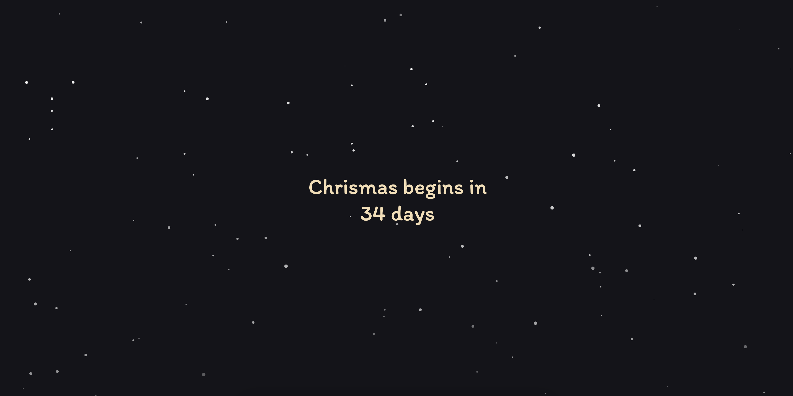

## 01-christmas-count-down

Displays how many days until christmas.

Some things I want to research more:
* Whats the difference between `DOMContentLoaded` and `load`.
* How does the snow animation work?

What I found helpful:
* [Blog post on how to add Jest tests for plain HTMl file](https://dev.to/snowleo208/things-i-learned-after-writing-tests-for-js-and-html-page-4lja). I went into this one thinking I would be able to good quality tests, I barely had time to do that!
* [Blog post I used for the snow effect](https://www.perssondennis.com/articles/33-christmas-animations-to-easily-add-to-your-website)

What I would of done differently:
* I don't like how the webpage is setup with all the javascript and HTML in the same project.
* The aim behind this webpage was to practice writing tests for normal webpages, I only wrote one!
