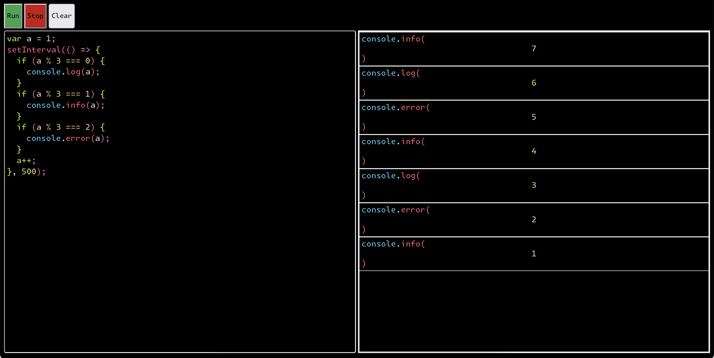

# 03 web IDE

A "IDE" created in a web browser.
This site definitely has a certain aesthetic!

A good code snippet to try on this site:

```javascript
var a = 1;
setInterval(() => {
  console.log(a);
  a++;
}, 500);
```



## Cool things

I used a dedicated worked to run the code.
This allows me to stop the code when I want.

I also set up typescript in this project.

The css comes from this [person](https://blog.glyphdrawing.club/font-with-built-in-syntax-highlighting/?utm_source=hackernewsletter&utm_medium=email&utm_term=design).
I'm quite happy I could get the console to display in the browser!
