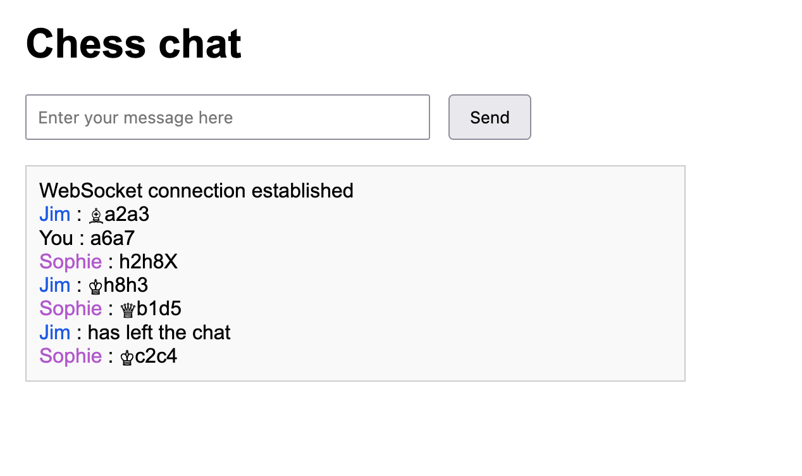

# chess chat

In the film "Arrival" Jeremy Renner's character Ian Donnelly says:

> They're using chess to communicate with the aliens.

So I've created a "chess chat" web project to explore this idea, users can only communicate using [Chess algebraic notation](https://en.wikipedia.org/wiki/Algebraic_notation_(chess)).

## What I found fun

* Using websockets to update the chat messages for everyone was fun. But my current implementation is incredibly unsecure.
* I was surprised that unicode has symbols for all chess pieces.